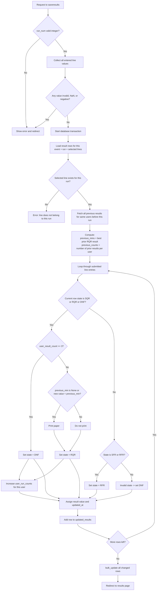

# Logic

```mermaid
flowchart TD
    A[Request to saveresults] --> B{run_num valid integer?}
    B -- No --> Z1[Show error and redirect]
    B -- Yes --> C[Collect all entered line values]
    C --> D{Any value invalid, NaN, or negative?}
    D -- Yes --> Z1
    D -- No --> E[Start database transaction]

    E --> F[Load result rows for this event + run + selected lines]
    F --> G{Selected line exists for this run?}
    G -- No --> Z2[Error: line does not belong to this run]
    G -- Yes --> H[Fetch all previous results for same users before this run]

    H --> I[Compute:
    previous_mins = best prior RQR result
    previous_counts = number of prior results per user]
    I --> J[Loop through submitted line entries]

    J --> K{Current row state is SQR or RQR or DNF?}

    K -- Yes --> L{user_result_count >= 3?}
    L -- Yes --> M[Set state = DNF]
    L -- No --> N{previous_min is None or new value < previous_min?}
    N -- Yes --> O[Print paper]
    N -- No --> P[Do not print]
    O --> Q[Set state = RQR]
    P --> Q
    M --> R[Increase user_run_counts for this user]
    Q --> R

    K -- No --> S{State is SFR or RFR?}
    S -- Yes --> T[Set state = RFR]
    S -- No --> U[Invalid state -> set DNF]

    M --> V[Assign result value and updated_at]
    Q --> V
    T --> V
    U --> V
    R --> V
    V --> W[Add row to updated_results]
    W --> X{More rows left?}
    X -- Yes --> J
    X -- No --> Y[bulk_update all changed rows]
    Y --> Z3[Redirect to results page]
```